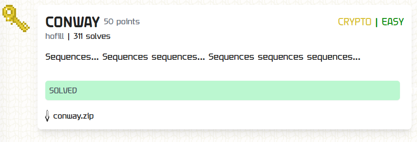

For this challenge two files are given, one containing the code:

```python
initial = 11131221131211131231121113112221121321132132211331222113112211

initial = generate_next_key(initial)
print(initial)

initial = generate_next_key(initial)
h = hashlib.sha256()
h.update(str(initial).encode())
key = h.digest()

cipher = AES.new(key, AES.MODE_ECB)
print(cipher.encrypt(pad(flag.encode(),16)).hex())
```

And one the output:

```text
311311222113111231131112132112311321322112111312211312111322212311322113212221
f143845f3c4d9ad024ac8f76592352127651ff4d8c35e48ca9337422a0d7f20ec0c2baf530695c150efff20bbc17ca4c
```

Seeing the first line in the output, the name and description of the task, I assumed that the `Look-and-Say Conway Sequence` was used by the generate_next_key function.

I tested it using: https://www.dcode.fr/conway-sequence and also generated the values of the variable `initial` (the value that is used to generate the key).

Then I generated the key:

```python
initial = 132113213221133112132113311211131221121321131211132221123113112221131112311332111213211322211312113211
h = hashlib.sha256()
h.update(str(initial).encode())
key = h.digest()
print(key)  #b'`\x9f\xd9\\!U\xdf\xc7m\xe2!,\x06\xb0\x9fO\xfa;\x91\x1d\x02;\x87\x1fE\xa4\xea\xb50\xb3\x93\xf3'
```
Now, I know the key and the encrypted message in hex, so I can find the flag through decryption:

```python
key = b'`\x9f\xd9\\!U\xdf\xc7m\xe2!,\x06\xb0\x9fO\xfa;\x91\x1d\x02;\x87\x1fE\xa4\xea\xb50\xb3\x93\xf3'
cipher = AES.new(key, AES.MODE_ECB)
encrypted_message_hex = "f143845f3c4d9ad024ac8f76592352127651ff4d8c35e48ca9337422a0d7f20ec0c2baf530695c150efff20bbc17ca4c"

encrypted_message = bytes.fromhex(encrypted_message_hex)


decrypted_padded_message = cipher.decrypt(encrypted_message)

flag = unpad(decrypted_padded_message, 16).decode()

print(flag)
```

`TFCCTF{c0nway's_g4me_0f_sequences?}`
