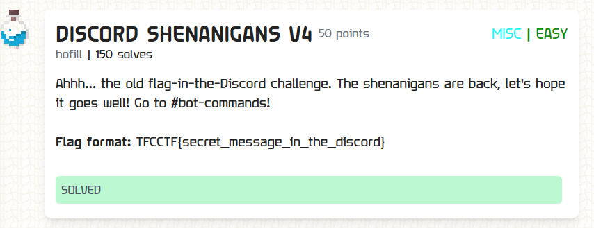
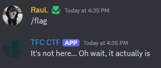

At #bot-commands if you typed `/flag` a bot would reply:

At first, I thought that a certain command was needed, after which the bot would DM you the flag. I even DM-ed the bot mysef, but no luck.

However, after playing with the discord interface (the 3 dots near the bot's message) and pressing `Speak Message`, I notice that the voice reads more than what it can be seen. So, somehow there is a hidden part in the bot's message. To better visiualise the hidden part I clicked `Copy Text`, which reveals:

`It's not here... Oh wait, it actually is ||​||||​||||​||||​||||​||||​||||​||||​||||​||||​||||​||||​||||​||||​||||​||||​||||​||||​||||​||||​||||​||||​||||​||||​||||​||||​||||​||||​||||​||||​||||​||||​||||​||||​||||​||||​||||​||||​||||​||||​||||​||||​||||​||||​||||​||||​||||​||||​||||​||||​||||​||||​||||​||||​||||​||||​||||​||||​||||​||||​||||​||||​||||​||||​||||​||||​||||​||||​||||​||||​||||​||||​||||​||||​||||​||||​||||​||||​||||​||||​||||​||||​||||​||||​||||​||||​||||​||||​||||​||||​||||​||||​||||​||||​||||​||||​||||​||||​||||​||||​||||​||||​||||​||||​||||​||||​||||​||||​||||​||||​||||​||||​||||​||||​||||​||||​||||​||||​||||​||||​||||​||||​||||​||||​||||​||||​||||​||||​||||​||||​||||​||||​||||​||||​||||​||||​||||​||||​||||​||||​||||​||||​||||​||||​||||​||||​||||​||||​||||​||||​||||​||||​||||​||||​||||​||||​||||​||||​||||​||||​||||​||||​||||​||||​||||​||||​||||​||||​||||​||||​||||​||||​||||​||||​||||​||||​||||​||||​||||​||||​||||​||||​||||​||||​||||​||||​||||​||||​||||​||||​||||​||||​||||​||||​||||​||||​||||​||||​|| _ _ _ _ _ _  add this to the format: zoo_wee_mama`

`TFCCTF{zoo_wee_mama}`
