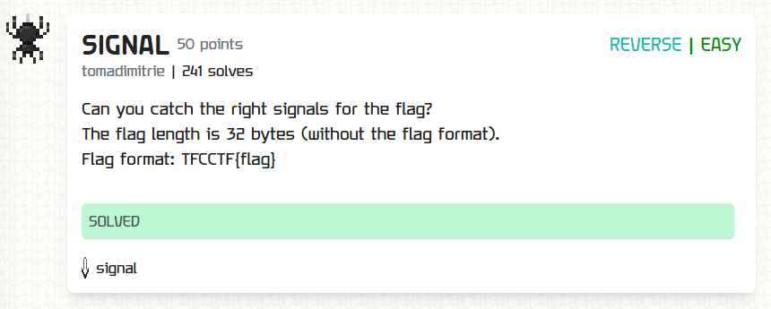
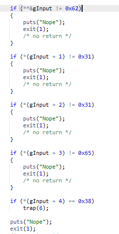

I used [dogbolt](https://dogbolt.org/) to decompile the given binary. There I saw multiple if conditions like this:

So after transforming the hex value into chars and carefully respecting the if conditions and also the traps (like the last condition in the picture) I got `b11e807f65b27dcf82e70c4bad63a3eb`. Giving this as input to the binary returns `Correct!`, thus the flag.

`TFCCTF{b11e807f65b27dcf82e70c4bad63a3eb}`
